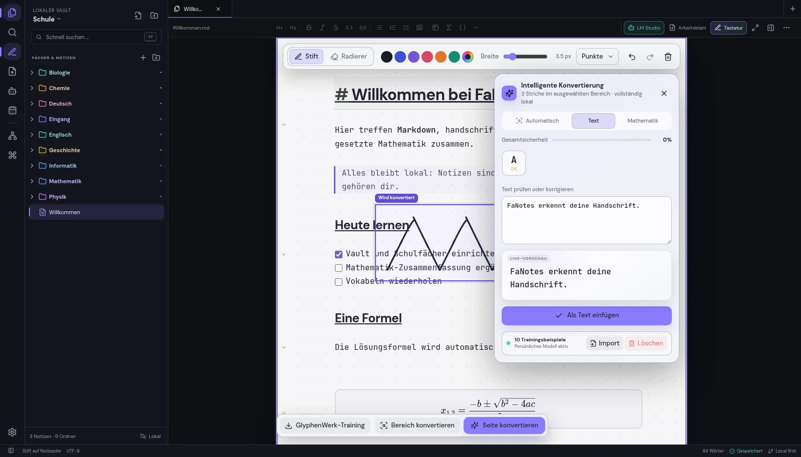

<div align="center">
  
  <h1>FaNotes</h1>
  <p><strong>One calm workspace for typed notes, handwriting, worksheets and mathematics.</strong></p>
  <p>Eine ruhige Arbeitsfläche für getippte Notizen, Handschrift, Arbeitsblätter und Mathematik.</p>

  [](https://github.com/Nikoheld/FaNotes/releases/latest)
  [](https://github.com/Nikoheld/FaNotes/releases)
  [](https://fanotes.fasrv.ch/)
  [](https://fanotes.fasrv.ch/)
  [](fanotes/packaging/LICENSE)

  [Website](https://fanotes.fasrv.ch/) · [Web app](https://fanotes.fasrv.ch/notes/) · [Downloads](https://github.com/Nikoheld/FaNotes/releases) · [English](#english)
</div>


## Deutsch

FaNotes verbindet eine echte Markdown-Wissensbasis mit einer papierartigen Schreibfläche. Tastatur, Grafiktablett, Bilder, PDFs und Formeln leben in derselben Notizansicht. Deine Notizen bleiben offene Dateien in einem frei wählbaren Vault; die Handschrifterkennung arbeitet lokal und kann mit deinen eigenen GlyphenWerk-Beispielen personalisiert werden.

### Was FaNotes besonders macht

- **Eine gemeinsame Seite:** Tippen, zeichnen und handschriftlich schreiben, ohne zwischen Editor und Vorschau zu wechseln.
- **Offene Markdown-Dateien:** Ordner, Wikilinks, Aufgabenlisten, Tabellen, Code, Mathematik und einklappbare Bereiche.
- **Handschrift und Mathematik:** Lokale Zeilen- und Glyphenerkennung für Text, Gleichungen, Brüche, Wurzeln, Indizes, Summen und Integrale.
- **GlyphenWerk integriert:** Eigene Zeichen erfassen, ZIP-Trainingsdaten importieren, Erkennung testen und Korrekturen direkt weiterlernen.
- **Arbeitsblätter:** PDF- und Bildseiten in neue oder bestehende Notizen importieren und mit Tastatur oder Stift ausfüllen.
- **AI nach Wahl:** LM Studio, Ollama, OpenAI, Gemini, Anthropic und OpenCode mit kombinierbaren Aktionen.
- **Für jeden Lebensbereich:** Profile und Vorlagen für Schule, Universität, Privatleben und Arbeit.
- **Desktop und Web:** Linux, Windows und eine installierbare Web-App mit gemeinsamer Oberfläche und Erkennungslogik.
- **Anpassbar:** Themes, Schriften, Papier, Pinsel, Farben, Abstände, Ressourcenlimits und eigenes CSS.
- **Privat by design:** Vault und persönliches Handschrifttraining bleiben lokal; ein abgesichertes Server-Backup ist optional.



### Downloads und Update-Kanäle

| Kanal | Zweck | Veröffentlichungen |
| --- | --- | --- |
| **Stable** | Gebündelte, vollständig geprüfte Alltagsversion | 2 bis höchstens 4 pro Monat |
| **Beta** | Früher Zugriff auf einzelne neue Funktionen und Korrekturen | nach Bedarf, als GitHub-Prerelease markiert |

Der Kanal lässt sich unter **Einstellungen → Updates → Update-Kanal** ändern. Stable-Nutzer erhalten keine Vorabversionen. Beta-Nutzer erhalten neue Betas und wechseln automatisch auf einen neueren Stable-Stand, sobald dieser verfügbar ist. Ein Wechsel zurück zu Stable führt niemals zu einem erzwungenen Downgrade.

Ab der Kalender-Versionierung tragen Releases Namen wie `2026.7.1` und Betas Namen wie `2026.7.2-beta.1`. Alle Update-Manifeste sind Ed25519-signiert; Pakete und differentielle Updates werden zusätzlich per SHA-256 geprüft.

Die aktuelle Version findest du unter [GitHub Releases](https://github.com/Nikoheld/FaNotes/releases). Die Produktseite bietet zusätzlich direkte Downloads und Installationshinweise für [Linux und Windows](https://fanotes.fasrv.ch/).

### Lokal entwickeln

Voraussetzungen: Node.js 22+, npm, Linux oder Windows. Für Desktop-Pakete werden die plattformspezifischen Electron-Abhängigkeiten benötigt.

```bash
# GlyphenWerk
npm install
npm run dev

# FaNotes Desktop/Web
cd fanotes
npm install
npm run dev          # Electron + Vite
npm run dev:web      # Browser-Ausgabe
```

Wichtige Prüfungen:

```bash
cd fanotes
npm run typecheck
npm run check:updater
npm run check:i18n
npm run check:connected-recognition
```

### Repository-Aufbau

```text
src/                  GlyphenWerk-Oberfläche und gemeinsame Erkennungsengine
fanotes/       FaNotes React-/Electron-/Web-App, Tests und Packaging
fanotes-site/         Produktwebsite, Update-API, AI-Proxy und Backup-Dienst
deliverables/         kleine, veröffentlichbare Begleitdateien
```

Erzeugte Builds, `node_modules`, private Schlüssel, lokale Vaults, Analytics und Server-Backups gehören nicht in Git. Release-Binärdateien werden vollständig und mit Prüfsummen an den jeweiligen GitHub-Release angehängt.

### Datenschutz und Sicherheit

- Keine Anmeldung ist für lokale Notizen erforderlich.
- Markdown-Vault, Zeichnungen und persönliches Training werden standardmäßig nur auf dem Gerät gespeichert.
- Cloud-AI wird ausschließlich verwendet, wenn du einen Anbieter selbst konfigurierst.
- API-Schlüssel werden in der Desktop-App über den geschützten Systemspeicher abgelegt.
- Update-Manifeste, Paketgrößen, Dateinamen, Herkunft, Signatur und SHA-256 werden vor der Installation geprüft.
- Das optionale Server-Backup akzeptiert nur begrenzte FaNotes-Daten und neu validierte Medien; aktive PDF-Inhalte und unbekannte Dateitypen werden blockiert.

## English

FaNotes combines an open Markdown knowledge base with a paper-like writing surface. Keyboard input, pen strokes, images, PDFs and formulas live on the same note page. Notes remain ordinary files inside a vault you control, while local handwriting recognition can be personalized with your own GlyphenWerk samples.

### Highlights

- **One continuous page** for typing, drawing and handwriting—without separate edit and preview modes.
- **Open Markdown files** with folders, wiki links, tasks, tables, code, mathematics and collapsible sections.
- **Local handwriting and math recognition** for text, equations, fractions, roots, indices, sums and integrals.
- **Integrated GlyphenWerk** for capture, ZIP import, recognition tests and correction-driven personal learning.
- **PDF and image worksheets** that can be completed with the keyboard or a drawing tablet.
- **Provider-neutral AI** through LM Studio, Ollama, OpenAI, Gemini, Anthropic or OpenCode.
- **Profiles for school, university, personal use and work.**
- **Linux, Windows and an installable web app** with a shared interface and recognition pipeline.
- **Deep customization** for themes, fonts, paper, brushes, colors, spacing, resource limits and custom CSS.
- **Private by design:** local vault and local personal training, with an optional hardened server backup.

### Stable and Beta

Stable builds bundle thoroughly tested changes into two to at most four releases per month. Beta builds deliver focused changes earlier and are marked as prereleases on GitHub. Choose the channel under **Settings → Updates → Update channel**. Returning from Beta to Stable never forces a downgrade.

Calendar versions use names such as `2026.7.1`; previews use names such as `2026.7.2-beta.1`. Update manifests are signed with Ed25519, and all full or differential packages are verified with SHA-256 before installation.

Download the latest build from [GitHub Releases](https://github.com/Nikoheld/FaNotes/releases), open the [web app](https://fanotes.fasrv.ch/notes/), or visit the [product website](https://fanotes.fasrv.ch/) for platform-specific installation help.

## License

FaNotes source code is available under the [MIT License](fanotes/packaging/LICENSE). Bundled models, fonts, dictionaries and third-party components retain their respective licenses; see [THIRD_PARTY_NOTICES.md](fanotes/packaging/THIRD_PARTY_NOTICES.md).
